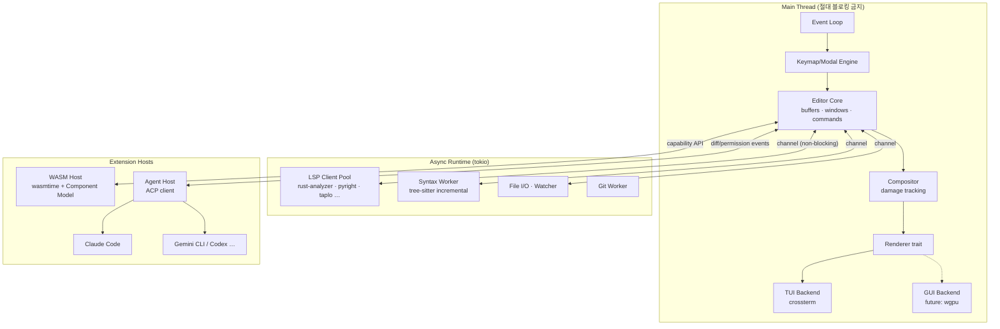
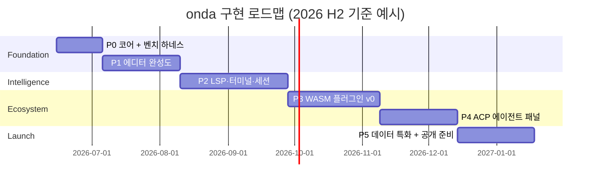

# onda — Rust 기반 모달 IDE 설계 문서

**Version:** v0.3 (Draft)
**Date:** 2026-06-12
**Status:** Accepted — 이름 확정: **onda**
**Author:** Beomsoo

---

## 1. 비전 & 철학

> **"Vim의 속도, IDE의 지능, 에이전트의 자율성 — 하나의 터미널 안에서."**

onda는 Rust로 작성된 모달(modal) 텍스트 에디터이자 IDE다. 세 가지 도구 카테고리를 동시에 대체하는 것이 목표다.

| 대체 대상 | onda가 제공하는 것 |
|---|---|
| Vim / Neovim | 모달 편집, 키보드 중심 워크플로우, 동등 이상의 성능 |
| VS Code / Cursor | LSP 기반 언어 인텔리전스 (자동완성, 진단, 리팩토링) |
| Claude Code / Codex CLI | ACP 기반 AI 에이전트 패널 (자율 코딩, diff 리뷰) |

**설계 원칙 (우선순위 순):**

1. **성능은 기능이다** — 모든 PR은 벤치마크 게이트를 통과해야 한다. Neovim보다 느려지는 변경은 머지하지 않는다.
2. **메인 루프는 절대 블로킹하지 않는다** — LSP, 파일 I/O, 플러그인, 에이전트는 전부 비동기. 키 입력 → 화면 반영 경로에 끼어들 수 없다.
3. **코어는 작게, 확장은 플러그인으로** — 코어에는 편집/렌더링/신택스/LSP/에이전트 호스트만. 나머지는 WASM 플러그인.
4. **Vim 사용자의 손가락을 존중한다** — motions/operators/registers/macros는 호환. 단, vimscript/Lua 생태계는 호환하지 않는다 (자체 생태계).

---

## 2. 확정된 핵심 결정 (ADR 요약)

| # | 결정 | 선택 | 근거 | 기각된 대안 |
|---|---|---|---|---|
| ADR-001 | Vim 호환 범위 | **Motions/키바인딩만, 자체 생태계** | vimscript/Lua 호환은 Neovim 재구현이 되어 성능 철학과 충돌. Helix가 자체 생태계로도 성공 가능함을 입증 | vimrc 호환, nvim Lua 플러그인 호환 |
| ADR-002 | 플러그인 런타임 | **WASM (Component Model)** | 샌드박스 안전성 + 다언어(Rust/Python/Go/JS) + near-native 성능. 크래시가 에디터를 죽이지 않음 | Lua 임베딩(단일 언어, 샌드박스 약함), native dylib(안전성), 외부 RPC(레이턴시) |
| ADR-003 | AI 통합 | **ACP 우선, 자체 엔진 후순위** | ACP(Agent Client Protocol)로 Claude Code, Gemini CLI 등 기존 에이전트를 즉시 연결. 에이전트 엔진 개발 리스크를 외부화 | 자체 엔진 우선(개발 비용 大, API 비용 관리 부담) |
| ADR-004 | 렌더링 | **TUI 우선, Renderer trait로 추상화** | 터미널이 1차 타깃. `Renderer` trait 뒤에 숨겨 추후 GPU GUI(wgpu) 백엔드 추가 가능 | GUI 동시 개발(스코프 폭발) |
| ADR-005 | 설정 포맷 | **TOML** | Rust 생태계 표준, 정적 파싱으로 시작 속도 보장. 로직이 필요한 설정은 WASM 플러그인으로 | Lua config(시작 시 인터프리터 비용), JSON(주석 불가) |
| ADR-006 | 멀티커서 | **1급 지원** (Selection = 1..N ranges) | Helix/Kakoune이 입증한 생산성. Vim motions를 모든 커서에 동시 적용하면 vim 사용자도 자연 학습 | visual-block만 지원 |
| ADR-007 | 세션 영속화 | **자동 세션 (zero-config)** — 상세 §5.8 | nvim의 수동 `:mksession`은 아무도 안 씀. VS Code식 자동 복원이 현대적 기대치 | 수동 세션만 |
| ADR-008 | 플랫폼 | **macOS/Linux 우선, Windows는 백로그** | crossterm이 기술적으로 커버하지만 테스트/지원 비용 절감. v0.x에서는 CI 빌드만 유지 | v0.1부터 Windows 공식 지원 |
| ADR-009 | 프로젝트 이름 | **onda** ("파도") | 추상 브랜드명으로 독립 정체성. crates.io·GitHub org 가용 확인 완료 (§9.1) | rim/rvim(사용 중), vrim/oxvim(vim 아류 프레임), 일본어 기반 이름 |

### 2.1 구현 ADR (Implementation ADRs)

ADR-001~009가 **제품 결정**(무엇을 만드는가)이라면, 아래 ADR-101+는 그 제품을
구현하는 **저수준 기술 결정**(어떻게 만드는가)이다. 제품 결정만큼 자주 바뀌지는
않지만, 성능 철학(AGENTS.md)을 떠받치는 근거이므로 동일하게 기록·추적한다.

| # | 결정 | 선택 | 근거 | 기각된 대안 |
|---|---|---|---|---|
| ADR-101 | 텍스트 엔진 | **rope (`ropey`)** | O(log n) 편집·슬라이스, GB급 파일에서도 일정한 편집 비용. 모든 변경은 `Transaction`/`ChangeSet`로만 적용 | gap buffer(대용량 약함), `String`(O(n) 편집) |
| ADR-102 | 터미널 백엔드 | **`crossterm`** | 크로스플랫폼(ADR-008과 정합), `event-stream`으로 async 입력. 자체 컴포지터 아래 얇은 I/O 계층으로만 사용 | termion(유닉스 전용), ncurses FFI(이식성·안전성) |
| ADR-103 | 비동기 런타임 | **`tokio` (multi-thread)** | 모든 잠재적 블로킹(파일 I/O·LSP·프로세스)을 워커로 보내고 채널로 회신; 메인 루프는 프레임당 한 번 드레인(AGENTS rule 2) | async-std(생태계 작음), 자체 스레드풀(재구현 비용) |
| ADR-104 | 컴포지터 | **자체 셀-그리드 컴포지터 + damage tracking** | 무거운 TUI 프레임워크를 쓰지 않고 셀 그리드를 직접 변경, 컴포지터가 diff. resize/theme 변경 외 전체 redraw 금지 | ratatui 등 TUI 프레임워크(전체 redraw·레이턴시·제어권 상실) |
| ADR-105 | 모션/오퍼레이터 | **순수 함수** `(rope, selection) → selection` | 부수효과 없는 함수라 테이블 주도 테스트가 쉽고, 1..N 셀렉션(ADR-006) 전체에 동일 적용 가능 | 커서 상태를 직접 변형하는 메서드(테스트·멀티커서 난이도) |
| ADR-106 | 키맵 | **정적 키맵 테이블** | 컴파일타임 정의로 시작 비용 0, 디스패치 분기 단순. 런타임 확장은 플러그인(WASM)으로 | 런타임 설정 키맵(시작 파싱 비용·복잡도) |
| ADR-107 | 라이선스 | **Apache-2.0 OR MIT 듀얼** | Rust 생태계 관례, 채택 마찰 최소화 | 단일 GPL(채택 마찰), 독점 |

---

## 3. 요구사항

### 3.1 기능 요구사항 (v1.0 기준)

- **편집**: Vim motions/operators/text objects, visual/visual-block, registers, macros, undo tree, 멀티 윈도우(split), 탭
- **언어 지능**: 파일 타입 자동 감지 → 신택스 하이라이팅, 실시간 진단(에러/경고), 자동완성, goto definition, hover, rename, format
- **1차 언어**: Python, Rust
- **1차 데이터 포맷**: JSON, JSONL, TOML, CSV — 단순 하이라이팅을 넘어 포맷별 특화 뷰 제공 (§5.4.2)
- **플러그인**: WASM 기반, 선언적 manifest, 권한 모델, 패키지 관리 명령 내장
- **AI 에이전트**: ACP로 외부 에이전트 연결, 사이드 패널 대화, diff 리뷰 후 적용, 도구 실행 권한 승인 UI
- **기본 도구**: fuzzy finder (파일/심볼/그렙), 파일 트리, 통합 터미널, git gutter

### 3.2 비기능 요구사항 — 성능 목표 (벤치마크 게이트)

| 지표 | 목표 | 비교 기준 | 측정 방법 |
|---|---|---|---|
| 콜드 스타트 (플러그인 0개) | **< 40ms** | nvim 무설정 ~30–80ms | hyperfine, `onda --bench-startup` |
| 키 입력 → 화면 반영 (p99) | **< 10ms** | 체감 즉시성 한계 | 내장 latency tracer |
| 1GB 로그 파일 열기 | **< 2s, 스크롤 60fps** | nvim은 신택스 켜면 버벅임 | 합성 파일 벤치 |
| 100k줄 Rust 파일 하이라이팅 | 입력 중 끊김 없음 | tree-sitter 증분 파싱 | 편집 시뮬레이션 벤치 |
| 유휴 메모리 (빈 버퍼) | **< 40MB** | nvim ~20MB, VS Code ~300MB+ | RSS 측정 |
| LSP 자동완성 표시 | 서버 응답 + < 5ms | UI 오버헤드 최소화 | E2E 트레이싱 |

> **운영 원칙**: Phase 0부터 벤치 하네스를 만들고 CI에서 회귀를 차단한다. "나중에 최적화"는 금지.

---

## 4. 아키텍처 개요



**핵심 패턴**: Editor Core가 단일 진실 소스(single source of truth). 모든 비동기 작업자는 채널로 이벤트를 보내고, 메인 루프가 한 프레임에 배치 처리한다. 렌더링은 변경된 셀만 다시 그리는 damage tracking 방식.

---

## 5. 핵심 컴포넌트 상세

### 5.1 텍스트 엔진 (`onda-core`)

- **자료구조**: Rope (`ropey` crate) — O(log n) 삽입/삭제, 1GB+ 파일도 lazy하게 처리
- **인코딩**: 내부 UTF-8, 비UTF-8 파일은 lossy 로드 + 원본 보존 저장
- **Undo**: 트리 구조 (vim의 undo tree 동일 개념), 영속 undo는 옵션
- **변경 추적**: `ChangeSet` (helix 방식) — LSP 증분 동기화, tree-sitter 증분 파싱, 플러그인 알림이 모두 같은 changeset을 소비
- **멀티커서**: 1급 지원 확정 (ADR-006). Selection = 1..N ranges가 코어 자료구조. Vim motions/operators가 모든 커서에 동시 적용, `<C-n>`(다음 매치 추가)·`s`(선택 영역 내 패턴 선택) 등 진입 키맵 제공

### 5.2 렌더링 (`onda-render`)

- 자체 셀 그리드 컴포지터: 프레임마다 grid diff → 변경 영역만 터미널에 flush
- 백엔드: `crossterm` (Windows/macOS/Linux). Kitty keyboard protocol, true color, undercurl 지원
- 프레임 예산: 16ms (60fps). 신택스/LSP 데코레이션이 늦으면 **그 프레임은 생략**하고 다음 프레임에 반영 (입력 레이턴시 > 장식 일관성)
- `Renderer` trait로 추상화 → Phase 6+에서 GPU GUI 백엔드 검토

### 5.3 신택스 레이어 (`onda-syntax`)

- **tree-sitter** 증분 파싱: 하이라이팅, 인덴트, text objects(`af`/`if` 함수 선택 등), 코드 폴딩
- 문법(grammar)은 컴파일된 동적 라이브러리로 배포, `onda grammar fetch/build` 명령 제공 (helix 방식)
- 파싱은 비동기 워커에서 수행, 타임아웃 시 이전 트리로 렌더 (입력 블로킹 금지)
- 신택스 **에러 노드 시각화**: LSP 없이도 tree-sitter ERROR 노드를 경고 표시 → JSON/TOML 같은 포맷은 LSP 전에도 즉시 에러 확인 가능

### 5.4 언어 인텔리전스 (`onda-lsp`)

#### 5.4.1 LSP 클라이언트

- `lsp-types` 기반 자체 비동기 클라이언트, 버퍼당 다중 서버 지원 (예: Python = basedpyright + ruff 동시)
- 디바운스된 증분 `didChange`, 요청 취소(`$/cancelRequest`) 적극 사용 → 타이핑 중 stale 응답 폐기
- 서버 크래시 자동 재시작 (백오프), 상태는 statusline에 표시

#### 5.4.2 1차 지원 매트릭스

| 포맷 | 감지 | 하이라이팅 | 에러 확인 | 자동완성/지능 | 특화 기능 |
|---|---|---|---|---|---|
| Rust | 확장자 + shebang | tree-sitter-rust | rust-analyzer | rust-analyzer (완성, inlay hints, 매크로 확장) | cargo 통합 태스크 |
| Python | 확장자 + shebang | tree-sitter-python | basedpyright + ruff | basedpyright | venv 자동 감지 |
| JSON | 확장자 + 내용 스니핑 | tree-sitter-json | TS 에러 노드 + vscode-json-ls | 스키마 기반 완성 (JSON Schema Store) | 경로 복사(jq path), 폴딩 |
| JSONL | `.jsonl`/`.ndjson` | 라인 단위 JSON | 라인별 파스 에러 (lazy) | — | **대용량 스트리밍 뷰**: 라인 = 레코드, 펼침/접힘, 필드 테이블 뷰 |
| TOML | 확장자 | tree-sitter-toml | taplo | taplo (스키마 완성: Cargo.toml, pyproject.toml) | — |
| CSV/TSV | 확장자 + 구분자 스니핑 | 컬럼별 색상 (rainbow) | 열 개수 불일치 경고 | 헤더명 기반 | **가상 테이블 모드**: 컬럼 정렬 표시, 헤더 고정, 컬럼 단위 이동/선택 |

> JSONL/CSV 특화 뷰는 데이터 엔지니어링 워크플로우에서 onda의 차별화 포인트. nvim/VS Code 모두 기본 제공하지 않음.

### 5.5 플러그인 시스템 (`onda-plugin`)

- **런타임**: `wasmtime` + **WASM Component Model** — WIT로 호스트 API를 타입 안전하게 정의
- **개발 언어**: WIT 바인딩이 있는 모든 언어 (Rust 1급, Python/JS/Go 가이드 제공)
- **권한 모델** (manifest 선언 + 사용자 승인):

```toml
# onda-plugin.toml
[plugin]
name = "git-blame-inline"
version = "0.1.0"
entry = "plugin.wasm"

[permissions]
buffer = "read"          # read | write | none
filesystem = ["./.git"]  # 허용 경로 화이트리스트
network = false
shell = false

[activation]
events = ["buffer-open", "cursor-hold"]  # lazy activation — 시작 속도 보호
```

- **호스트 API (WIT) v0 범위**: buffer read/write, selection, 커맨드/키맵 등록, statusline/virtual text 데코레이션, picker UI, 설정 읽기, 이벤트 구독
- **성능 가드**: 플러그인 호출당 시간 예산(예: 5ms), 초과 시 비동기로 강등 + 경고. 플러그인이 메인 루프를 잡을 수 없는 구조
- **배포**: git 저장소 = 패키지. `onda plugin install github:user/repo`. 추후 레지스트리 검토

### 5.6 AI 에이전트 (`onda-agent`)

- **프로토콜**: ACP (Agent Client Protocol, JSON-RPC over stdio) — Zed가 주도하는 표준. `agent-client-protocol` Rust crate 사용
- **연결 대상**: Claude Code (1차 검증 타깃), Gemini CLI, 기타 ACP 호환 에이전트
- **UI 구성**:
  - 사이드 패널: 대화 스레드, 에이전트의 계획/도구 호출 실시간 스트리밍
  - **Diff 리뷰 모드**: 에이전트가 제안한 변경을 hunk 단위로 accept/reject (git add -p UX)
  - **권한 게이트**: 파일 쓰기/셸 실행 요청 시 인라인 승인 프롬프트 (always allow / once / deny)
  - 컨텍스트 멘션: `@file`, `@selection`, `@diagnostics`로 에디터 상태를 에이전트에 전달
- **자체 엔진 (후순위, Phase 7+)**: Anthropic API 직접 호출하는 내장 에이전트. ACP 인터페이스를 그대로 구현해 UI 재사용 — 즉, 자체 엔진도 "ACP 에이전트 중 하나"로 취급해 아키텍처 분기 없음

### 5.7 설정

- `~/.config/onda/config.toml` + 프로젝트 로컬 `.onda/config.toml` (오버레이 병합)
- 키맵, 테마, LSP 서버 설정, 플러그인 목록 모두 선언적 TOML
- 로직이 필요한 커스터마이징(조건부 키맵 등)은 플러그인으로 — 설정 파싱이 시작 속도에 영향을 주지 않게 유지

### 5.8 세션/프로젝트 영속화 (`onda-session`)

**철학: 사용자가 세션을 "관리"하게 만들지 않는다.** nvim의 `:mksession`이 실패한 이유는 수동이기 때문. onda는 VS Code처럼 자동으로 동작하되, 성능 예산을 침범하지 않는다.

#### 동작 모델

- **세션 키**: git root(없으면 cwd)의 정규화 경로 해시 → `~/.local/share/onda/sessions/<hash>/`
- **자동 저장**: 종료 시 + 유휴 시 주기적 스냅샷 (크래시 대비)
- **자동 복원**: 같은 디렉토리에서 `onda` 실행 시 복원. `onda --no-session`으로 우회, `onda <file>`은 세션 복원 + 해당 파일 포커스

#### 저장 범위 — 3단계 레벨

| 레벨 | 내용 | 기본값 | 비고 |
|---|---|---|---|
| **L1 — 레이아웃** | 열린 버퍼 목록, 윈도우 split 레이아웃, 커서/스크롤 위치, jumplist, 검색 히스토리, named registers | **ON** | 텍스트는 저장 안 함 → 가볍고 안전 |
| **L2 — 영속 undo** | 파일별 undo tree (mtime+해시 검증, 불일치 시 폐기) | OFF (옵션) | vim `undofile` 동급 |
| **L3 — Hot Exit** | 저장 안 한 변경분을 draft로 보관 → 크래시/강제종료 후에도 미저장 내용 복원 | OFF → v1.0에서 ON 검토 | VS Code 대비 vim 계열의 최대 약점 해소. swap 파일의 현대적 대체 |

#### 성능 & 안전 설계

- **Lazy restore**: 포커스된 버퍼만 즉시 로드, 나머지는 메타데이터만 가진 placeholder → 접근 시 로드. 버퍼 50개짜리 세션도 콜드 스타트 40ms 목표 유지
- **무효화**: 파일이 외부에서 변경됐으면(해시 불일치) 커서 위치는 마커 기반 best-effort 복원, undo/draft는 폐기
- **포맷**: `session.toml`(사람이 읽을 메타: 버퍼 목록, 레이아웃) + 바이너리 blob(undo tree, draft — 크기/속도)
- **Named session**: `:session save <name>` / `onda --session <name>` — 자동 세션과 별개로 명시적 컨텍스트 전환용
- **(아이디어, 백로그)** git 브랜치 연동: 브랜치 전환 감지 시 세션을 브랜치별로 분기 — 리뷰 작업 ↔ 기능 개발 컨텍스트 스위칭


```
onda/
├── Cargo.toml              # workspace
├── crates/
│   ├── onda-core/           # rope, changeset, undo tree, selection
│   ├── onda-modal/          # vim motions/operators/registers/macros 상태머신
│   ├── onda-syntax/         # tree-sitter 통합, 문법 로더
│   ├── onda-lsp/            # LSP 클라이언트 풀
│   ├── onda-render/         # 컴포지터, Renderer trait, TUI 백엔드
│   ├── onda-plugin/         # wasmtime 호스트, WIT 바인딩, 권한
│   ├── onda-agent/          # ACP 클라이언트, diff 리뷰 엔진
│   ├── onda-session/        # 자동 세션, 영속 undo, hot exit
│   ├── onda-config/         # TOML 설정, 키맵 파서
│   └── onda/                # 바이너리: event loop, 조립
├── wit/                    # 플러그인 호스트 API 정의 (versioned)
├── runtime/
│   ├── grammars/           # tree-sitter 문법 소스 목록
│   ├── queries/            # highlight/indent/textobject 쿼리
│   └── themes/
└── xtask/                  # 벤치마크, 문법 빌드, 릴리스 자동화
```

**의존성 핵심 선택**: `ropey`(rope) · `crossterm`(터미널) · `tree-sitter` · `tokio`(async) · `wasmtime`(WASM) · `agent-client-protocol`(ACP) · `lsp-types` · `nucleo`(fuzzy matching, helix와 동일)

---

## 7. 구현 플랜

전제: 솔로 개발 + Claude Code 페어링, 파트타임 기준. 각 Phase는 **데모 가능한 마일스톤**으로 끝난다.



### Phase 0 — 스켈레톤 + 성능 하네스 (3주)
**목표: "빈 깡통이지만 세상에서 가장 빠른 모달 에디터"**
- [ ] Workspace 셋업, event loop, rope 버퍼, 파일 open/save
- [ ] Modal 엔진: normal/insert/visual, 핵심 motions (`hjkl w b e f t gg G 0 $`), operators (`d c y p`), counts
- [ ] 셀 그리드 컴포지터 + crossterm 백엔드, damage tracking
- [ ] **벤치 하네스**: startup, 입력 레이턴시, 대용량 파일 — CI에서 회귀 차단 시작
- ✅ 데모: 1GB 파일을 열어 nvim보다 빠르게 스크롤

### Phase 1 — 에디터 완성도 (5주)
**목표: "onda로 onda를 개발한다" (dogfooding 시작)**
- [ ] tree-sitter 하이라이팅: Rust, Python, JSON, TOML + 에러 노드 표시
- [ ] 파일 타입 감지 (확장자 + shebang + 내용 스니핑)
- [ ] undo tree, registers, macros, `.` repeat, text objects
- [ ] regex 검색/치환, split 윈도우, statusline
- [ ] fuzzy file picker (`nucleo`), 최소 파일 트리
- ✅ 데모: 일상 편집 작업을 onda에서 수행

### Phase 2 — 언어 지능 + 워크스페이스 (7주)
**목표: "VS Code 없이 Python/Rust 개발 가능"**
- [ ] LSP 클라이언트: lifecycle, 증분 sync, 요청 취소, 멀티 서버
- [ ] diagnostics(인라인 + 목록), completion 팝업, hover, goto def/ref, rename, format-on-save
- [ ] rust-analyzer, basedpyright + ruff, taplo, vscode-json-ls 연동 검증
- [ ] 워크스페이스 그렙 (ripgrep 통합), 심볼 picker
- [ ] **통합 터미널**: split/floating 터미널 패널, 버퍼 ↔ 터미널 텍스트 전송, 작업 디렉토리 동기화
- [ ] **자동 세션 L1**: 레이아웃/커서 복원 (§5.8) — dogfooding 체감 품질 직결
- ✅ 데모: 실무 Python/Rust 프로젝트에서 풀 IDE 워크플로우

### Phase 3 — WASM 플러그인 시스템 (6주)
**목표: "써드파티가 확장 가능한 플랫폼"**
- [ ] WIT 호스트 API v0 설계 + 동결, wasmtime 호스트
- [ ] 권한 모델 + 승인 UI, lazy activation, 시간 예산 가드
- [ ] `onda plugin install/update/list`, Rust 플러그인 템플릿 (`cargo generate`)
- [ ] 레퍼런스 플러그인 3종: git blame inline, TODO 하이라이터, HTTP 클라이언트(권한 모델 검증용)
- ✅ 데모: 외부인이 문서만 보고 플러그인 1개 작성

### Phase 4 — AI 에이전트 (5주)
**목표: "Claude Code를 onda 안에서"**
- [ ] ACP 클라이언트, Claude Code 연결
- [ ] 에이전트 패널: 스트리밍 대화, 계획/도구 호출 표시
- [ ] diff 리뷰 모드 (hunk accept/reject), 권한 게이트 UI
- [ ] `@file` / `@selection` / `@diagnostics` 컨텍스트 멘션
- ✅ 데모: 터미널 분할 없이 onda 패널에서 에이전트로 기능 구현 → diff 리뷰 → 적용

### Phase 5 — 데이터 특화 + 공개 (5주)
- [ ] CSV 가상 테이블 모드, JSONL 스트리밍 레코드 뷰
- [ ] 영속 undo (세션 L2), named session
- [ ] 테마 시스템 + 기본 테마 3종, 헬스 체크(`onda doctor`)
- [ ] 배포: `cargo install`, Homebrew, GitHub Releases (musl static) — macOS/Linux
- [ ] 문서 사이트, 벤치마크 공개 (vs nvim/helix — 신뢰의 핵심)
- ✅ 마일스톤: **v0.1 public release**

### Phase 6+ (백로그)
Hot Exit(세션 L3) · **Windows 공식 지원** (v0.x는 CI 빌드만 유지) · DAP 디버깅 · GPU GUI 백엔드 · 자체 에이전트 엔진(ACP 인터페이스로) · 플러그인 레지스트리 · git 브랜치 연동 세션 · 협업 편집(CRDT) · Tree-sitter 기반 구조적 편집

---

## 8. 리스크 & 완화

| 리스크 | 영향 | 완화 |
|---|---|---|
| **스코프 폭발** — "nvim 전체 재구현" 함정 | 영원히 미출시 | Phase별 데모 게이트. vim 기능은 "내가 매주 쓰는 것"만 우선. 호환성 이슈는 backlog로 |
| WIT API를 너무 일찍 동결 → 설계 부채 | 플러그인 생태계 파편화 | v0는 `unstable` 마킹, Phase 5 전까지 breaking change 허용 명시 |
| ACP 스펙이 아직 진화 중 | 에이전트 연동 깨짐 | 어댑터 레이어로 격리, Claude Code 버전 핀 + CI 통합 테스트 |
| tree-sitter 문법 배포 (dylib 빌드 환경 이슈) | 설치 경험 악화 | 주요 문법은 prebuilt 바이너리 동봉, 나머지만 `onda grammar build` |
| Helix와의 차별화 부족 | "왜 onda?" | 차별화 3축에 집중: ① vim 키바인딩 (helix는 비호환) ② WASM 플러그인 (helix는 수년째 미지원) ③ 1급 에이전트 통합 |
| 솔로 유지보수 번아웃 | 프로젝트 정체 | 코어 최소화, CI 자동화, Claude Code로 테스트/문서 위임 |

---

## 9. 미해결 질문 (다음 결정 필요)

### 9.1 프로젝트 이름 — ✅ 확정: onda (ADR-009)

**onda** (이탈리아어/스페인어 "파도") — 모달 편집의 흐름(flow)을 담은 추상 브랜드명. vim 패밀리 작명을 벗어나 helix/zed처럼 독립 브랜드로 성장 가능.

| 네임스페이스 | 상태 (2026-06-12 확인) |
|---|---|
| crates.io `onda` | ✅ 가용 |
| GitHub `onda-editor` (org) | ✅ 가용 — helix-editor 패턴. **즉시 선점 필요** |
| GitHub `onda` (user) | ❌ 사용 중 (org명으로는 불필요) |
| 도메인 | 미확인 — `onda.dev`, `onda-editor.dev`, `getonda.dev` 순으로 확인 권장 |

기각 후보: vrim/oxvim(vim 아류 프레임), kado·tanto·tachi(일본어 기반 — 작명 방향 제외), falx, raffica.

### 9.2 기타

1. **세션 L3(Hot Exit) 기본값**: v1.0에서 ON으로 갈지 — draft 저장의 디스크/프라이버시 트레이드오프 검토 필요
2. **에이전트 ↔ 통합 터미널 관계**: Phase 4에서 에이전트가 터미널 세션을 직접 관찰/제어하게 할지 (예: 에이전트가 실패한 테스트 출력을 자동으로 컨텍스트에 포함)
3. **플러그인 API에 세션 훅 노출 여부**: 플러그인이 자체 상태를 세션에 영속화할 수 있게 할지 (WIT API v0 vs v1)

---

## 변경 이력

| 버전 | 날짜 | 내용 |
|---|---|---|
| v0.1 | 2026-06-11 | 최초 작성. ADR-001~005 확정 반영 |
| v0.2 | 2026-06-12 | ADR-006(1급 멀티커서)·007(자동 세션)·008(Windows 백로그) 추가. §5.8 세션 영속화 설계 신설. 통합 터미널 Phase 2 편입. 이름 후보 조사 결과 반영 (§9.1) |
| v0.3 | 2026-06-12 | **프로젝트 이름 onda 확정 (ADR-009)**. 전체 문서·crate·명령어 네이밍 일괄 변경 |
